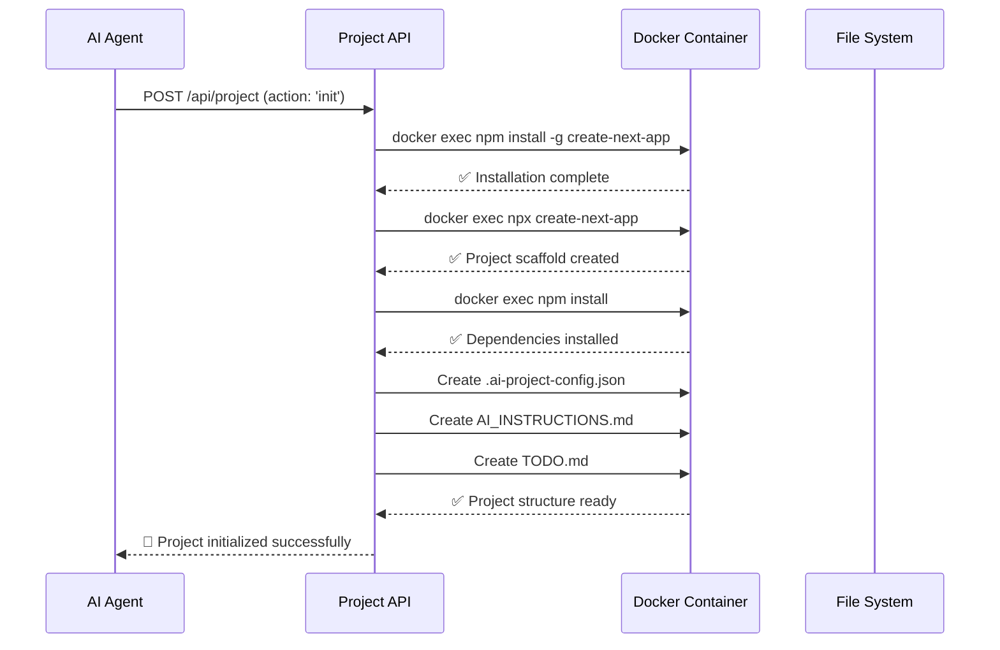

# AI Web IDE 後端架構設計

## 🎯 核心設計決策

### Call Tool 技術選型：混合式架構

經過深入分析，我們採用**混合式架構**，結合專用 API 與 MCP 協議的優勢：

**第一層：專用 Project API**

- 負責專案生命週期管理（創建、初始化、狀態監控）
- 容器操作與 Docker 整合
- 安全權限控制與沙箱隔離

**第二層：容器內 MCP 服務**

- 負責檔案系統操作
- 終端命令執行
- Git 版本控制
- 實時檔案監控

## 🏗️ 系統架構圖

```
┌─────────────────────┐
│   AI Agent (Cursor) │
└──────────┬──────────┘
           │ HTTP/WebSocket
┌──────────▼──────────┐
│  AI Web IDE Backend │
│  ┌─────────────────┐│
│  │   Tool Router   ││  ← 統一工具調用入口
│  └─────────────────┘│
│  ┌─────────────────┐│
│  │ Project Manager ││  ← 專案生命週期管理
│  └─────────────────┘│
│  ┌─────────────────┐│
│  │Security Gateway ││  ← 權限控制與驗證
│  └─────────────────┘│
└──────────┬──────────┘
           │ Docker API
┌──────────▼──────────┐
│   Container Layer   │
│ ┌─────────────────┐ │
│ │ Container A     │ │  ┌─────────────────┐
│ │ ┌─────────────┐ │ │  │ Container B     │
│ │ │ MCP Server  │ │ │  │ ┌─────────────┐ │
│ │ └─────────────┘ │ │  │ │ MCP Server  │ │
│ │ ┌─────────────┐ │ │  │ └─────────────┘ │
│ │ │ Next.js App │ │ │  │ ┌─────────────┐ │
│ │ └─────────────┘ │ │  │ │ Next.js App │ │
│ │ ┌─────────────┐ │ │  │ └─────────────┘ │
│ │ │Project Files│ │ │  │ ┌─────────────┐ │
│ │ └─────────────┘ │ │  │ │Project Files│ │
│ └─────────────────┘ │  │ └─────────────┘ │
└─────────────────────┘  └─────────────────┘
```

## 🔧 核心組件設計

### 1. Project API (`/api/project`)

**職責範圍：**

- 專案初始化與 Next.js scaffold 建立
- 容器生命週期管理
- 檔案操作統一接口
- 命令執行代理
- 專案狀態監控

**主要端點：**

```typescript
POST /api/project
- action: 'init'     // 初始化Next.js專案
- action: 'file'     // 檔案操作 (CRUD)
- action: 'command'  // 執行命令

GET /api/project
- action: 'status'    // 獲取專案狀態
- action: 'structure' // 獲取專案檔案結構
```

### 2. AI Toolkit (`/lib/ai-tools.ts`)

**統一工具介面：**

```typescript
export class AIToolkit {
  fileSystem: FileSystemTool; // 檔案操作
  command: CommandExecutionTool; // 命令執行
  project: ProjectManagementTool; // 專案管理
}
```

**核心功能：**

- 專案自動初始化檢查
- React 組件快速創建
- 命令序列執行
- 部署與預覽自動化

### 3. 容器管理層

**現有功能整合：**

- Docker 容器創建與標記 (`ai-web-ide-*`)
- 容器狀態監控與健康檢查
- 三階段容器刪除策略
- 動態端口映射

## 🚀 Next.js 專案初始化流程



## 🔐 安全設計

### 權限控制層級

1. **容器隔離**

   - 每個專案運行在獨立容器中
   - 限制容器網絡訪問
   - 文件系統掛載限制

2. **API 層級控制**

   - 檔案操作路徑驗證
   - 命令白名單機制
   - 操作權限檢查

3. **資源限制**
   - 容器 CPU 和記憶體限制
   - 磁碟空間配額
   - 命令執行超時控制

### 沙箱保護機制

```typescript
// 檔案路徑安全檢查
const validateFilePath = (filePath: string): boolean => {
  // 禁止訪問父目錄
  if (filePath.includes("../")) return false;

  // 禁止訪問系統目錄
  const forbidden = ["/etc", "/usr", "/bin", "/sbin"];
  if (forbidden.some((dir) => filePath.startsWith(dir))) return false;

  return true;
};

// 命令白名單檢查
const allowedCommands = ["npm", "git", "node", "npx", "yarn"];
const validateCommand = (command: string): boolean => {
  return allowedCommands.includes(command);
};
```

## 📁 AI 檔案系統掌握機制

### 1. 專案結構發現

```typescript
// 獲取完整專案結構
const getProjectStructure = async (projectId: string) => {
  const result = await execInContainer(projectId, "find", [
    ".",
    "-type",
    "f",
    "-not",
    "-path",
    "./node_modules/*",
    "-not",
    "-path",
    "./.git/*",
  ]);

  return result.stdout.split("\n").filter((line) => line.trim());
};
```

### 2. 智能檔案分析

```typescript
// AI專案配置檔案
interface AIProjectConfig {
  projectType: "nextjs" | "react" | "vue";
  version: string;
  aiManaged: boolean;
  structure: Record<string, string>; // 目錄說明
  dependencies: string[]; // 關鍵依賴
  entryPoints: string[]; // 主要入口檔案
}
```

### 3. 目錄語義標記

AI 可透過 `.ai-project-config.json` 了解：

- 各目錄的用途說明
- 重要檔案的作用
- 專案的技術棧配置
- 建議的檔案組織方式

## 🔄 實時同步機制

### 檔案變更監控

```typescript
// 容器內檔案監控
const watchFiles = async (projectId: string) => {
  await execInContainer(projectId, "inotifywait", [
    "-m",
    "-r",
    "-e",
    "modify,create,delete",
    "--format",
    "%w%f %e",
    "/app/workspace",
  ]);
};
```

### 增量同步策略

- 監控檔案變更事件
- 批量處理小變更
- 大檔案使用差異同步
- 實時狀態廣播給前端

## 🛠️ AI 工具使用範例

### 基本工作流程

```typescript
// 1. 建立工具實例
const toolkit = createAIToolkit({
  projectId: "ai-web-ide-my-blog-123456",
  projectName: "my-blog",
  containerStatus: "running",
});

// 2. 確保專案初始化
await toolkit.ensureProjectInitialized();

// 3. 檢查專案結構
const structure = await toolkit.project.getProjectStructure();

// 4. 讀取現有檔案
const currentPage = await toolkit.fileSystem.readFile("src/app/page.tsx");

// 5. 創建新組件
await toolkit.createReactComponent("BlogPost", blogPostCode);

// 6. 安裝依賴
await toolkit.command.npmCommand(["install", "moment"]);

// 7. 執行測試
await toolkit.command.npmCommand(["test"]);
```

### 進階操作範例

```typescript
// 批量檔案操作
const createBlogStructure = async () => {
  const files = [
    { path: "src/components/BlogHeader.tsx", content: headerCode },
    { path: "src/components/BlogPost.tsx", content: postCode },
    { path: "src/lib/blog-utils.ts", content: utilsCode },
    { path: "src/styles/blog.css", content: stylesCode },
  ];

  for (const file of files) {
    await toolkit.fileSystem.createFile(file.path, file.content);
  }
};

// 命令序列執行
await toolkit.command.executeCommandSequence([
  { command: "git", args: ["add", "."] },
  { command: "git", args: ["commit", "-m", "Add blog components"] },
  { command: "npm", args: ["run", "build"] },
  { command: "npm", args: ["run", "test"] },
]);
```

## 📊 性能與監控

### 性能優化策略

1. **命令執行優化**

   - 命令結果快取
   - 並行執行支援
   - 智能重試機制

2. **檔案操作優化**

   - 大檔案分塊處理
   - 壓縮傳輸
   - 增量更新

3. **容器資源管理**
   - 按需啟動容器
   - 閒置容器自動暫停
   - 資源使用監控

### 監控指標

- 容器健康狀態
- API 響應時間
- 檔案操作成功率
- 命令執行統計
- 資源使用情況

## 🚦 部署與環境

### 開發環境

- 本地 Docker 環境
- 模擬數據支援
- 熱重載開發模式

### 生產環境

- Docker Swarm 或 Kubernetes
- 負載均衡與高可用
- 數據持久化策略
- 安全加固配置

## 🔮 擴展性設計

### 支援更多專案類型

- React 專案模板
- Vue.js 專案支援
- Node.js API 專案
- 靜態網站生成器

### AI 能力擴展

- 代碼自動完成
- 錯誤診斷與修復
- 性能優化建議
- 安全漏洞掃描

### 團隊協作功能

- 多用戶專案共享
- 即時協作編輯
- 版本控制整合
- 代碼審查流程

---

## 📝 總結

這個混合式架構設計充分發揮了專用 API 和 MCP 協議的優勢：

✅ **專用 API 負責**：專案管理、容器控制、安全守護
✅ **MCP 協議負責**：檔案操作、命令執行、即時同步
✅ **AI 工具整合**：統一介面、智能檢查、批量操作
✅ **安全保障**：多層防護、沙箱隔離、權限控制

這樣的設計既保證了系統的可控性和安全性，又提供了 AI 代理程式所需的靈活性和完整功能。透過標準化的工具介面，AI 可以輕鬆地執行專案初始化、檔案編輯、依賴管理、測試部署等完整的開發流程。
